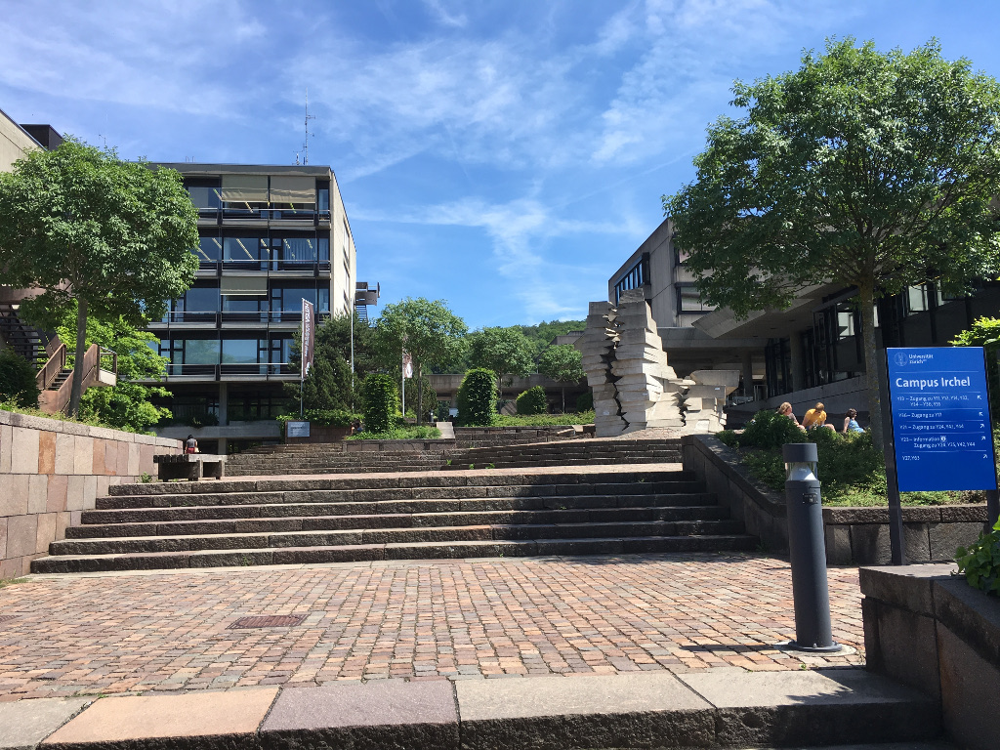

# Welcome to the Robinson Lab!

We are located in the [Department of Molecular Life Sciences](http://www.mls.uzh.ch/en.html) within the [Faculty of Science](http://www.mnf.uzh.ch/en.html) at the [University of Zurich](http://www.uzh.ch/en.html).

Research in our laboratory is focused on creating, comparing and understanding statistical methods and data science tools for processing and interpreting various types of genomic data. You can learn about [our research](research.html), the [resources](tools.html) we make, [who we are](people.html) or the [papers](publications.html) we publish.

