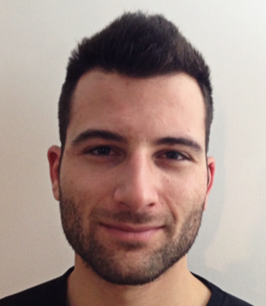
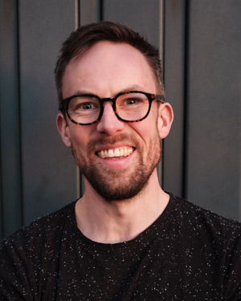
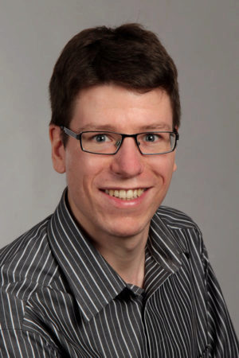
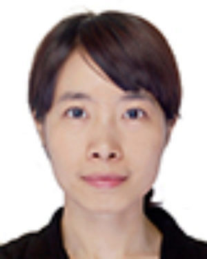
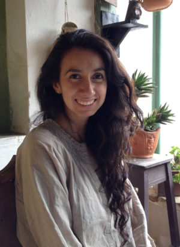
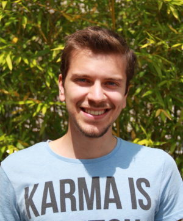
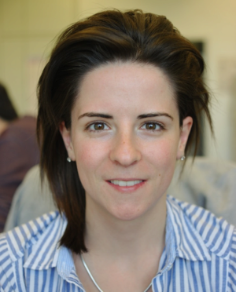

```{r message=FALSE, warning=FALSE, include=FALSE}
# required to use 'Font Awesome' (FA) icons (Website, Twitter, GitHub, etc)
htmltools::tagList(rmarkdown::html_dependency_font_awesome())
```


```{r echo=FALSE, message=FALSE, warning=FALSE}
# Instructions:
# - Add one new block of code for each team member.
# - To add custom linebreaks in text sections, use the HTML tag <br> for linebreaks.
# - To add 'Font Awesome' (FA) icons, you can use the following HTML code and suggested icons:
#     Website: <i class='fa fa-desktop'></i>
#     Twitter: <i class='fa fa-twitter'></i>
#     GitHub:  <i class='fa fa-github'></i>
#     Google Scholar: <i class='fa fa-newspaper-o'></i>
#     LinkedIn: <i class="fa fa-linkedin-square"></i>
# - For additional icons (e.g. LinkedIn), see the following website:
# https://www.w3schools.com/icons/fontawesome_icons_webapp.asp

tbl_mark <- data.frame(
  img = "", 
  bio = c("Mark D Robinson", 
          paste0("<i class='fa fa-twitter'></i> Twitter [\\@markrobinsonca](https://twitter.com/markrobinsonca)<br>", 
                 "<i class='fa fa-github'></i> GitHub [markrobinsonuzh](https://github.com/markrobinsonuzh)<br>", 
                 "<i class='fa fa-newspaper-o'></i> [Google Scholar](https://scholar.google.ch/citations?user=XPfrRQEAAAAJ)"), 
          paste0("My research interests are diverse, but more-or-less encompass the general application of statistical ", 
                 "methods and data science to experimental data with biological applications.  Often, this is within the ",
                 "context of genomics data types, but we are interested in methodological challenges and robust solutions ",
                 "in data, generally. We also try to be modern scientists, with a focus on reproducibility (repos for code) ",
                 "and open science (preprints)."),
          paste0("PhD in Medical Biology (2008), University of Melbourne (Walter and Eliza Hall Institute)<br>", 
                 "MSc in Statistics (2001), University of British Columbia<br>",
                 "BSc in Applied Mathematics and Statistics (1999), University of Guelph"))
)

# tbl_joanna <- data.frame(
#   img = "", 
#   bio = c("Joanna Zyprych-Walczak", 
#           paste0("<i class='fa fa-github'></i> GitHub [joanna](https://github.com/zjanna)<br>"), 
#           paste0("My scientific work focuses mainly on the development and applications of various statistical ",
#                  "methods to data from microarray and next generation sequencing experiments (NGS). ", 
#                  "Professionally I am very satisfied with being able to apply my statistical knowledge and to advise ",
#                   "on issues such as experimental design, statistical models and testing, designing novel statistical approaches ",
#                    "and to explain their interpretations to the domain experts in biology and medicine."),
#           paste0("PhD in Biostatistics (2011), Poznan University of Life Sciences, Department of Mathematical and Statistical Methods<br>", 
#                  "MSc in Mathematics (2006), Adam Mickiewicz University, Faculty of Mathematics and Computer Science,<br>"))
# )


# tbl_charlotte <- data.frame(
#   img = "", 
#   bio = c("Charlotte Soneson", 
#           paste0("<i class='fa fa-desktop'></i> [Website](http://csoneson.github.io/)<br>", 
#                  "<i class='fa fa-twitter'></i> Twitter [\\@CSoneson](https://twitter.com/CSoneson)<br>", 
#                  "<i class='fa fa-github'></i> GitHub [csoneson](https://github.com/csoneson)<br>", 
#                  "<i class='fa fa-newspaper-o'></i> [Google Scholar](https://scholar.google.ch/citations?user=c28GqkIAAAAJ)"), 
#           paste0("As a postdoctoral research associate, one of my main interests is the ", 
#                  "development and improvement of statistical methods and workflows, currently mainly ", 
#                  "in the field of RNA-seq. I am also interested in the process of evaluating and ", 
#                  "comparing methods in an objective, robust and reproducible manner."), 
#           paste0("PhD in Mathematics (2011), Lund University<br>", 
#                  "MSc in Engineering Physics (2005), Lund University"))
# )

tbl_simone <- data.frame(
  img = "", 
  bio = c("Simone Tiberi", 
                  paste0("<i class='fa fa-desktop'></i> [Website](https://sites.google.com/view/simonetiberi)<br>",
                  "<i class='fa fa-twitter'></i> Twitter [\\@tiberi_simone](https://twitter.com/tiberi_simone)<br>",
                  "<i class='fa fa-github'></i> GitHub [SimoneTiberi](https://github.com/SimoneTiberi)<br>", 
                  "<i class='fa fa-newspaper-o'></i> [Google Scholar](https://scholar.google.com/citations?hl=en&user=58nWpq8AAAAJ&view_op=list_works&gmla=AJsN-F4oKYjm4oTFUio_EFmbXkpF5n0dgQOv-C9pfBGgyBq4ffqGAeJ2R6HwC1VNmMuSkj_NTMa-BQ5H7RyLxqZ6hr5yUsTej9kccy4vFeVjIAIgGy1uIH8)"), 
          paste0("I am a Postdoc working on the development of cutting-edge ",
                 "statistical methods in bioinformatics, mostly for bulk and single-cell RNA-seq data.",
                 "Previously, I was a PhD student at the Department of Statistics at the University of Warwick, ", 
                 "where I worked on stochastic Bayesian hierarchical models to investigate transcription in single cells.",
                 "In general terms, my interests are broad and lie in  the development of statistical methods for applications in biology."), 
          paste0("PhD in Statistics (2017), The University of Warwick<br>", 
                 "MSc in Statistics (2012), The University of Padua<br>", 
                 "BSc in Statistics (2010), Sapienza University of Rome"))
)

tbl_izaskun <- data.frame(
  img = "",
  bio = c("Izaskun Mallona",
          paste0("<i class='fa fa-desktop'></i> [Website](http://imallona.bitbucket.io)<br>", 
                  "<i class='fa fa-newspaper-o'></i> [Google Scholar](https://scholar.google.ch/citations?user=kMfxCIYAAAAJ)"), 
          paste0("I am mainly interested in gene expression modulation, as it lays the ground for any cell fate. ",
                 "The questions which excite my curiosity the most are: ",
                 "How are gene expression programs coded? and maintained? ",
                 "how do they adapt during development? and disease? ",
                 "To mine the regulation metastructure genome-wide I'm fond of integrating ",
                 "gene expression and epigenomic data, and to develop methods for doing so. "),
          paste0("BSc in Computer Engineering (2014), Open University of Catalonia<br/>",
                 "PhD (2012), Technical University of Cartagena<br/>",
                 "MSc in Agriculture Engineering (2008), Technical University of Cartagena<br/>",
                 "MSc in Biology (2007), University of Murcia"))
)

# tbl_will <- data.frame(
#   img = "", 
#   bio = c(
#     "Will Macnair", 
#     paste0(
#       "<i class='fa fa-twitter'></i> Twitter [\\@willmacnair](https://twitter.com/willmacnair)<br>", 
#       "<i class='fa fa-github'></i> GitHub [wmacnair](https://github.com/wmacnair)<br>"
#       ), 
#     paste0(
#       "I am a postdoc developing statistical and computational methods for analysis of single cell data, ", 
#       "mainly different flavours of single cell RNA-seq, but also cytometry data. ",
#       "I'm motivated by sharp, biologically-driven research questions, and empirically sound methods to answer them. ",
#       "My PhD focused on analysis of trajectories in single cell data, via testing for the presence of branchpoints ([
#         TreeTop](https://github.com/wmacnair/TreeTop)), and identification of genes underlying sequential labels ([
#         psupertime](https://github.com/wmacnair/psupertime)).", 
#       ""
#       ), 
#     paste0(
#       "PhD in Computational Biology (2018), ETH Zürich <br/>",
#       "MSc in Systems Biology (2013), University of Warwick <br/>",
#       "Certificate of Advanced Studies in Mathematics (2004), University of Cambridge <br/>",
#       "BA in Mathematics (2003), University of Cambridge <br/>"
#     )
#   )
# )

tbl_imran <- data.frame(
  img = "", 
  bio = c(
    "Imran Fanaswala", 
    paste0(
      "<i class='fa fa-twitter'></i> Twitter [\\@IFanaswala](https://twitter.com/IFanaswala)<br>"
      ), 
    paste0(
      "Imran Fanaswala has worked in academia and industry for over a decade; his passion lies in " ,
      "value-driven research (i.e. addressing unmet needs through research as well as bringing ideas to market). ",
      "His work has spanned various fields (robotics, phylogenetics, DNA-assembly, neuroscience) but ",
      "often within the machine-learning/AI context (and more recently, \"ModelOps\"). He strives for ",
      "readable code, succint prose, and meaningful research."
      ), 
    paste0(
      "MSc in Computational Biology (2014), ETH Zürich (thesis at RIKEN) <br/>",
      "BSc in Computer Science (2006), American University of Sharjah <br/>"
    )
  )
)

# tbl_lukas <- data.frame(
#   img = "", 
#   bio = c("Lukas Weber", 
#           paste0("<i class='fa fa-twitter'></i> Twitter [\\@lmwebr](https://twitter.com/lmwebr)<br>", 
#                  "<i class='fa fa-github'></i> GitHub [lmweber](https://github.com/lmweber)<br>", 
#                  "<i class='fa fa-newspaper-o'></i> [Google Scholar](https://scholar.google.ch/citations?user=M8uPSzMAAAAJ)"), 
#           paste0("I am a PhD student in biostatistics, working on the development of statistical and ", 
#                  "computational methods for analysis of various types of high-throughput biological data. ", 
#                  "The main focus of my project is on methods for differential discovery in high-dimensional ", 
#                  "single-cell flow and mass cytometry data. These methods are now available in the ", 
#                  "[diffcyt](http://bioconductor.org/packages/diffcyt) R package from Bioconductor. ", 
#                  "I also enjoy teaching, especially R programming and data analysis skills as an instructor for ", 
#                  "[Software and Data Carpentry](https://carpentries.org/)."), 
#           paste0("MSc in Statistics (2014), ETH Zürich"))
# )

tbl_kathi <- data.frame(
  img = "", 
  bio = c("Katharina Hembach", 
          paste0("I have a background in bioinformatics and I am a shared PhD student with the ", 
                 "[Polymenidou lab](http://www.imls.uzh.ch/en/research/polymenidou.html). ", 
                 "They focus on understanding the ", 
                 "molecular mechanisms of neurodegenerative diseases such as Amyotrophic Lateral Sclerosis (ALS) ", 
                 "and Frontotemporal Lobar Degeneration (FTLD). I help with the analysis and interpretation of ", 
                 "different sequencing data, such as RNA-seq, CLIP-seq, and iCLIP. My main project is the ", 
                 "development of a pipeline for the identification and quantification of alternative splicing events, ", 
                 "specifically microexons and cryptic exons, from RNA-seq data."), 
          paste0("MSc in Bioinformatics (2015), LMU and TU Munich<br>",
                 "BSc in Bioinformatics (2012), LMU and TU Munich"))
)

tbl_stephan <- data.frame(
  img = "", 
  bio = c("Stephan Schmeing",
          paste0("<i class='fa fa-twitter'></i> Twitter [\\@StephanSchmeing](https://twitter.com/StephanSchmeing)<br>", 
                 "<i class='fa fa-github'></i> GitHub [schmeing](https://github.com/schmeing)<br>"), 
          paste0("As a PhD student coming from a particle physics background I am currently working ", 
                 "on a more realistic Illumina sequence simulator called ReSequenceR. It is able to ", 
                 "create a profile from a bam file that is then used to simulate paired-read fastq files. ", 
                 "Furthermore I will work on an assembly and population genomics of the Indo-Pacific ", 
                 "bottlenose dolphin (tursiops aduncus)."), 
          paste0("MSc in Astro, Particle and Nuclear physics (2014), TU Munich<br>", 
                 "BSc in Physics (2011), TU Munich"))
)

# tbl_fiona <- data.frame(
#   img = "", 
#   bio = c("Ruizhu Huang", 
#           paste0("My major research interest is in the development and application of statistical ", 
#                  "methods in biological data. Currently, I am working on the project about tree ", 
#                  "signal aggregation."), 
#           paste0("MSc in Biostatistics (2015), University of Zürich<br>", 
#                  "BSc in Applied Chemsitry (2010), Wuhan University"))
# )

tbl_vladimir <- data.frame(
  img = "",
  bio = c("Vladimir B. C. de Souza",
          paste0("I am a PhD candidate in Bioinformatics, and I work with method development for long-read ",
                 "RNA-seq from PacBio data (Iso-Seq). I have developed a ",
                 "[pipeline](https://github.com/vladimirsouza/lrRNAseqVariantCalling) that allows variant ",
                 "calling with high performance from Iso-Seq data. The preprint of this work is available ",
                 "in [bioRxiv](https://www.biorxiv.org/content/10.1101/2022.02.08.479579v1)."),
          paste0("MSc in Applied Statistics (2015), University of Vicosa<br>",
                 "BSc in Biology (2013), University of Vicosa"))
)

# tbl_stephany <- data.frame(
#   img = "", 
#   bio = c("Stephany Orjuela", 
#           "<i class='fa fa-github'></i> GitHub [sorjuela](https://github.com/sorjuela)<br>",
#           paste0("I have a shared PhD position with the [Marra lab](http://www.imcr.uzh.ch/en/research/Marra/Team.html), ", 
#                  "which focuses on studying the molecular mechanisms underlying the development ", 
#                  "and progression of Colorectal Cancer. Most of my work focuses on analyzing and ", 
#                  "developing methods to process methylation data obtained from Bisulfite-seq. I am currently developing a method to identify differential allele-specific methylation. "), 
#           paste0("MSc in Biology (2017), University of Zürich<br>", 
#                  "BSc in Biology (2015), Universidad Nacional de Colombia"))
# )

tbl_stefan <- data.frame(
  img = "", 
  bio = c("Stefan Milosavljevic",
          paste0("<i class='fa fa-linkedin-square'></i> [LinkedIn](https://www.linkedin.com/in/stefan-milosavljevic-07361b8a/) <br>",  
                 "<i class='fa fa-github'></i> GitHub [supermaxiste](https://github.com/supermaxiste)<br>"),
          paste0("I have a shared PhD position with the ",
                 "[Shimizu lab](http://www.ieu.uzh.ch/en/research/evolbiol/ecogenomics.html). ",
                 "I've got a background in biology and bioinformatics and I'm currently ", 
                 "working on the rapid evolution of a plant species called _Arabidopsis_ _kamchatica_. ", 
                 "My project focuses on epigenetic modifications over short timescales and my general ", 
                 "aim is to assess the impact and the importance of DNA methylation in evolution over ", 
                 "short periods (rapid evolution)."), 
          paste0("MSc in Computational Biology and Bioinformatics (2017), ETH Zürich and University of Zürich<br>", 
                 "BSc in Biology (2015), Université de Lausanne"))
)

tbl_helena <- data.frame(
  img = "", 
  bio = c("Helena Lucia Crowell", 
          "<i class='fa fa-twitter'></i> Twitter [\\@CrowellHL](https://twitter.com/CrowellHL)<br>",
          paste0("In collaboration with the [Bodenmiller lab](http://www.bodenmillerlab.com) lab, ", 
                 "I have worked on correcting for spillover in CyTOF data. The preprint to this ", 
                 "project is available on [bioRxiv](https://doi.org/10.1101/185744) and has been ", 
                 "published in [cell systems](https://doi.org/10.1016/j.cels.2018.02.010). ", 
                 "Alongside our compensation approach, I have made Finck et al.'s ", 
                 "[bead-based normalization](https://doi.org/10.1002/cyto.a.22271) and Zunder et al.'s ", 
                 "[single-cell deconvolution](https://doi.org/10.1038/nprot.2015.020) available in ", 
                 "[CATALYST](https://bioconductor.org/packages/release/bioc/html/CATALYST.html) ", 
                 "(**C**ytometry d**AT**a an**ALYS**is **T**ools): a [Bioconductor](https://bioconductor.org) ", 
                 "package providing tools for preprocessing and analysis of cytometry data; and have further ", 
                 "integrated M. Nowicka's [CyTOF workflow](https://f1000research.com/articles/6-748/v2) for ",
                 "differential analysis into the package. As a PhD student, I am currently working on ",
                 "extending this framework for differential discovery to scRNA-seq data with complex ",
                 "experimental designs."), 
          paste0("MSc in Computational Biology & Bioinformatics (2018), ETH Zürich<br>", 
                 "BSc in Biochemistry (2015), University of Heidelberg"))
)

# tbl_angelo <- data.frame(
#   img = "", 
#   bio = c("Angelo Duo", 
#           paste0("Text here"), 
#           "More text here")
# )

# tbl_helen <- data.frame(
#   img = "", 
#   bio = c("Helen Lindsay", 
#           paste0("Text text text text text text text text text text text text text text ", 
#                  "text text text text text text text text text text text text text "), 
#           paste0("More text (e.g. qualifications)<br>", 
#                  "More text"))
# )

tbl_almut <- data.frame(
  img = "", 
  bio = c("Almut Lütge",
          paste0("I'm a PhD student with a background in Molecular Biotechnology, ",
                 "but already during my master I focused on Bioinformatics. ",
                 "I'm interested in all kinds of genomic analysis, but mainly worked with transcriptomic data, so far. ", 
                 "My PhD project is about methods in single cell RNAseq and part of a Sinergia collaboration on defining ",
                 "the  identity  and  differentiation  pathways of the immune-stimulating fibroblastic tumor stroma."), 
          paste0("MSc in Molecular Biotechnology (2018), University of Heidelberg<br>", 
                 "BSc Molecular Biotechnology (2013), University of Heidelberg"))
)

tbl_plger <- data.frame(
  img = "", 
  bio = c("Pierre-Luc Germain",
          paste0("<i class='fa fa-github'></i> GitHub [plger](https://github.com/plger)<br>", 
          "<i class='fa fa-newspaper-o'></i> [Google Scholar](https://scholar.google.com/citations?user=788GnysAAAAJ)"), 
          paste0( "I gradually shifted from the humanities to bioinformatics towards the end of my PhD, ",
                  "worked a lot in the past on linking chromatin alterations to gene expression, and currently ",
                  "work mostly on the analysis of short RNA-seq and single-cell RNA-seq, as well as pre- and ",
                  "post-transcriptional regulation of gene expression especially in the context of neurodevelopment. ",
                  "I have a shared position with the ETH's D-HEST Institute for Neurosciences." ),
          paste0( "PhD in Philosophy of science (2014), SEMM and University of Milan<br/>",
                  "MA in Philosophy (2009), University of Montreal<br/>",
                  "BA in Philosophy (2007)" )
        )
)

tbl_anthony <- data.frame(
  img = "", 
  bio = c("Anthony Sonrel", 
          "<i class='fa fa-linkedin-square'></i> [LinkedIn](https://www.linkedin.com/in/anthony-sonrel-612505114/) <br>",  
          paste0("I am a PhD student that joined the Robinson Lab as part of the Life Science Zürich Graduate School.", 
                 " Through my past projects in academia and industry I worked on various topics such as NGS,", 
                 " GWAS summary statistics,  epigenetic analyses (ChIP/ATAC-seq) and deep neural networks.", 
                 " In my current project, I'm evaluating and developing tools (mainly R packages) for single-cell", 
                 " RNA sequencing datasets. More specifically,  I'm interested in developing new methodologies",
                 " and new effective tools."), 
          paste0("MSc in Molecular Life Sciences - Bioinformatics (2018), University of Lausanne<br>", 
                 "BSc of Science in Biology (2015), University of Lausanne"))
)

tbl_reto <- data.frame(
  img = "", 
  bio = c("Reto Gerber",  
          paste("I joined the Robinson Lab as a PhD student after working as a Research Assistant in the group. During this time I worked on 
          scRNA-seq data from Synovial tissue in collaboration with USZ. Furthermore I developped 
          [pubassistant.ch](https://pubassistant.ch) (R shiny app to help consolidate publication profiles of researchers) and 
          [censcyt](https://bmcbioinformatics.biomedcentral.com/articles/10.1186/s12859-021-04125-4) (method for differential abundance analysis in cytometry where a covariate is subject to censoring)."
                  ), 
          paste0("MSc of Science in Computational Biology and Bioinformatics (2020), ETH, University of Zürich<br>",
                 "BSc of Science in Biology (2017), University of Zürich"))
)

tbl_elyas <- data.frame(
  img = "", 
  bio = c("Elyas Heidari",  
          paste0("I am a Master student of Computational Biology & Bioinformatics at ETH university. I am interested",
                 " in developing analysis pipelines for single-cell multi-omics data. Currently, I am exploring",
                 " single-cell B/T-cell receptor data to understand the diversity in immune repertoire and phenotypes.",
                 " Prior to joining Robinson lab, I worked on developing a number of machine/deep learning tools", 
                 " for biomedical data. I have developed [MUVIS](https://baio-lab.github.io/muvis/index.html) for general medical data analysis and [SeqLearner](http://seqlearner.readthedocs.io/) for semi-supervised learning on protein sequences."
                  ), 
          paste0("BSc of Science in Applied Mathematics (2019), Sharif University of Technology<br>", "BSc of Science in Computer Engineering (2019), Sharif University of Technology<br>"))
)

tbl_emanuel <- data.frame(
  img = "", 
  bio = c("Emanuel Sonder", 
	        paste0("<i class='fa fa-twitter'></i> Twitter [\\@EmanuelSonder](https://twitter.com/EmanuelSonder)<br>", 
                 "<i class='fa fa-github'></i> GitHub [emsonder](https://github.com/emsonder)<br>"), 
          paste0("After finishing my Master’s Thesis in the Robinson Group, I started a shared PhD position with the [Schratt lab](https://schrattlab.ethz.ch/the-group.html). I have a general interest in the analysis of epigenetic data (ATAC-seq, WGBS). My PhD project is focused on the reverse engineering of cell type-specific transcriptional networks by integrating different data modalities. The overarching goal is to provide insights in brain cell type specific responses to different stressors when compared with neuronal activity."),
          paste0("MSc in Computational Biology and Bioinformatics (2021), ETH Zürich, University of Zürich<br>",
                 "BSc in Biology (2018), ETH Zürich")
          )
  )

tbl_vlad <- data.frame(
   img = "",
   bio = c("Vladyslav Korobeynyk",
            "<i class='fa fa-github'></i> GitHub [vkorobeynyk](https://github.com/vkorobeynyk)<br>",
           paste0("I did my master thesis in single cell analysis of the adult mouse hippocampus in Jessberger Lab, HIFO, UZH. Shortly after, I started working as an intern in Systems Biology group at Roche, where I gained experience in ML and different type of sequencing technologies. Currently I am doing a shared PhD with Jessberger Lab, where my project is based on using single-cell and spatial transcriptomics data to identify molecular changes, mainly in the neurogenic niche, that drive neurogenesis to decline with age. "),
           paste0("MSc in Biochemistry (2021), University of Zurich<br>",
                  "BSc in Biochemistry (2017), University Nova of Lisbon")
           )
   )

tbl_joel <- data.frame(
  img = "",
  bio = c("Joël Meili",
          "<i class='fa fa-github'></i> GitHub [joelmeili](https://github.com/joelmeili)<br>",
          paste0("I am a master's student in the Biostatistics program at UZH. Currently I am working on my master's thesis which aims to propose a novel method that compares RNA velocities to identify cell clusters and genes within the clusters with different RNA velocities. The main aim is to compare experimental conditions (e.g. healthy vs. disease). However, the framework shoud also allow for comparisions of cell clusters from individual samples (e.g. B cells vs. T cells)."), 
          paste0("BSc in Engineering and Management (2019), Zurich University of Applied Sciences")
          )
  )

tbl_ahmad <- data.frame(
  img = "", 
  bio = c("Ahmad Al Ajami", 
          "<i class='fa fa-linkedin-square'></i> [LinkedIn](https://www.linkedin.com/in/ahmad-al-ajami-2ba577168/) <br>",  
          paste0("I am a master's student in the Computational Biology and Bioinformatics joint program of ETHZ and UZH.", 
                 " I am currently working on my master's thesis where I am continuing work that I conducted", 
                 " during my internship at Roche. The project is about implementation and extension of", 
                 " existing reference-based methods for cell annotation in single-cell RNA sequencing.", 
                 " Throughout the years, I have developed particular interest in immunology, data analysis", 
                 " and integration of single-cell data from different biological modalities. "), 
          paste0("BSc in Genetics and Bioinformatics (2018), Bahcesehir University"))
)


tbl_dominique <- data.frame(
  img = "", 
  bio = c("Dominique Paul", 
          paste0("<i class='fa fa-desktop'></i> [Website](http://www.thisiscrispin.com/)<br>",
                 "<i class='fa fa-twitter'></i> Twitter [\\@dominiquecapaul](https://twitter.com/DominiqueCAPaul)<br>", 
                 "<i class='fa fa-github'></i> GitHub [dominiquepaul](https://github.com/DominiquePaul)<br>"), 
          paste0("I am a Research Assistant at the Robinson lab. Currently I am working on a project with",
                 " the lab team and researchers from the the university hospital to understand the effects",
                 " of a new treatment method on systemic scleroris. I mainly work with and am interested",
                 " in methods for single-cell RNA-seq data"),
          paste0("Master student in Statistics, ETH Zurich"))
)


tbl_cpy <- data.frame(
  img = "", 
  bio = c("Peiying Cai",  
          paste0("As a Master student in the Biostatistics program of UZH, ",
                 "I am currently working on my master thesis. The project aims to propose a novel methodology for differential analyses from spatial transcriptomics data, ",
                 "that identifies spatially variable (SV) genes as well as the specific areas of the tissue affected by SV. ",
                 "Furthermore, the method will also investigate how spatial expression patterns vary between conditions (e.g., healthy vs. disease). ",
                 "Then, ideally the framework could be extended to do the same things with cell types."
                  ), 
          paste0("BSc of Science in Statistics (2019), Xiamen University"))
)

tbl_haolyu <- data.frame(
  img = "", 
  bio = c("Hao Lyu", 
          paste0("<i class='fa fa-desktop'></i>[Website](https://scholar.google.com/citations?user=llaoggIAAAAJ&hl=en&oi=ao)<br>"),
          paste0("I am a visiting PhD student with a background in bioinformatics",
                 "Prior to joining Robinson lab, I worked on developing machine learning/deep learning tools for identifying DNA, RNA, and protein modification sites",
                 "Currently, I am interested in developing computational pipeline to identify chromatin loops from single-cell Hi-C data."
                 ),
          paste0("MSc of Biophysics (2019), University of Electronic Science and Technology of China<br>","BSc of Bioinformatics (2017), Shanxi agricutural university<br>"))
  )

tbl_david <- data.frame(
  img = "",
  bio = c(
    "David Wissel",
    paste0(
      "I am a shared PhD student between the Robinson Lab at UZH and the BoevaLab at ETH. ",
      "I am broadly interested in survival analysis, single-cell and spatial transcriptomics as well as applications of machine learning to all of these."
    ),
    paste0("MSc Statistics (2021), ETH Zurich<br>", "BSc Business Administration (2019), Free University of Berlin<br>")
  )
)

tbl_siyuan <- data.frame(
  img = "",
  bio = c(
    "Siyuan Luo",
    paste0(
      "I'm an external PhD student from the [von Meyenn lab](https://epigenetics.ethz.ch/) with a background in computational biology and bioinformatics. ",
      "During my master study, I worked on various topics including copy number variation and TCR/BCR repertoire analysis. ",
      "Now I'm mainly interested in analyzing single-cell epigenetic data (ATAC-seq/CUT&Tag). ",
      "My PhD is about methods for single-cell multi-omics data to reveal the interplay between the epigenetic layers ",
      "and transcriptomics and provide insights for chronic diseases like obesity and ageing."
    ),
    paste0("MSc in Computational Biology and Bioinformatics (2021), ETH Zürich, University of Zürich<br>", "BSc in Biotechnology (2018), Harbin Institute of Technology<br>")
  )
)
```


```{r, echo=FALSE, message=F}

# combine all in list (re-order here as appropriate, e.g. by seniority)
tables_all <- list(
  tbl_mark, 
  #tbl_joanna, 
  tbl_simone,
  tbl_izaskun,
  tbl_plger,
  #tbl_will,
  #tbl_imran,
  #tbl_lukas, 
  #tbl_kathi, 
  # tbl_stephan, 
  # tbl_fiona, 
  # tbl_vladimir, 
  #tbl_stephany, 
  tbl_stefan, 
  tbl_helena,
  tbl_almut,
  tbl_anthony,
  #tbl_haolyu,
  tbl_reto,
  #tbl_elyas,
  tbl_emanuel,
  tbl_vlad,
  tbl_david,
  tbl_siyuan,
  #tbl_joel,
  #tbl_ahmad,
  tbl_dominique,
  tbl_cpy
#  tbl_charlotte, 
#  tbl_angelo,
#  tbl_helen
  )
```


```{r echo=FALSE, message=FALSE, warning=FALSE, paged.print=FALSE, results="asis"}
# R code to output HTML code

library(knitr)
library(kableExtra)
library(magrittr)

# remove column names
tables_all <- lapply(tables_all, function(tbl) {
  colnames(tbl) <- NULL
  tbl
})

# output HTML code using 'kableExtra' package
# note: loop requires 'results="asis"' in code chunk header, and 'print' command at the end
for (i in seq_along(tables_all)) {
  kable(tables_all[[i]], escape = FALSE) %>% 
    kable_styling(bootstrap_options = "condensed", full_width = FALSE) %>% 
    column_spec(column = 1, width = "3cm") %>% 
    column_spec(column = 2, width = "20cm") %>% 
    row_spec(row = 1, bold = TRUE, font_size = 18) %>% 
    collapse_rows(columns = 1, valign = "top") %>% 
    # hack to remove row borders between table cells (by adding additional options to HTML code for table cells)
    gsub('<td style="', '<td style="border:none;', .) %>% 
    cat
}
```

## Alumni
- Hao Lyu (visiting PhD student)
- Elyas Heidari (Research assistant; author of [SageNet](https://github.com/MarioniLab/SageNet); now PhD student at EMBL Heidelberg)
- Vladimir B. C. de Souza (PhD student; author of [lrRNAseqVariantCalling](https://github.com/vladimirsouza/lrRNAseqVariantCalling))
- Imran Fanaswala (Research assistant; founder of [YugaCell](https://yugacell.com/))
- Stephan Schmeing (PhD student; author of [ReSeq](https://github.com/schmeing/ReSeq))
- Ahmad Al Ajami (MSc student)
- Kathi Hembach (PhD student; author of [DISCERNS](https://github.com/khembach/DISCERNS); co-author of [ARMOR](https://github.com/csoneson/ARMOR))
- Stephany Orjuela (PhD student; author of [DAMEfinder](https://github.com/markrobinsonuzh/DAMEfinder); co-author of [ARMOR](https://github.com/csoneson/ARMOR); now Scientific software developer at [Oncobit](https://oncobit.com/))
- Will Macnair (Postdoc; author of [SampleQC](https://github.com/wmacnair/SampleQC/); now Data Scientist at [Hoffman La Roche](https://www.roche.ch/))
- Ruizhu (Fiona) Huang (PhD student; author of [treeclimbR](https://github.com/fionarhuang/treeclimbR), [TreeSummarizeExperiment](https://www.bioconductor.org/packages/release/bioc/html/TreeSummarizedExperiment.html), co-author of [ARMOR](https://github.com/csoneson/ARMOR); now Biostatistician at Cardio-CARE)
- [Joanna Zyprych-Walczak](http://merlin.up.poznan.pl/kmmis2/index.php?id=158&id2=105) (visiting professor)
- [Charlotte Soneson](http://csoneson.github.io/) (postdoc, investigated [various](https://f1000research.com/articles/4-1521/) [aspects](https://genomebiology.biomedcentral.com/articles/10.1186/s13059-015-0862-3) of [RNA-seq](https://www.nature.com/articles/nmeth.4612) [data](http://www.life-science-alliance.org/content/2/1/e201800175) and [method](https://www.nature.com/articles/nmeth.3805) [benchmarking](https://academic.oup.com/bioinformatics/article/34/4/691/4345646); now at [FMI](https://www.fmi.ch))
- Helen Lindsay (postdoc, author of [CrispRVariants](https://bioconductor.org/packages/release/bioc/html/CrispRVariants.html); now at [EPFL](https://www.epfl.ch/))
- Charity Law (postdoc, worked on differential splicing; now at [WEHI](https://www.wehi.edu.au/))
- Andrea Riebler (postdoc, author of [BayMeth](https://genomebiology.biomedcentral.com/articles/10.1186/gb-2014-15-2-r35) in [Repitools](http://bioconductor.org/packages/release/bioc/html/Repitools.html) package; now at [NTNU](https://www.ntnu.edu/imf))
- Ian Morilla (postdoc, involved in differential expression analysis using de novo RNA-seq assemblies; now at [INSERM](https://www.inserm.fr/))
- [Lukas Weber](https://lmweber.github.io/) (PhD student, [compared CyTOF clustering algorithms](https://onlinelibrary.wiley.com/doi/full/10.1002/cyto.a.23030), author of [diffcyt](https://www.nature.com/articles/s42003-019-0415-5), reviewed [benchmarking](https://genomebiology.biomedcentral.com/articles/10.1186/s13059-019-1738-8); now at [JHU](https://www.jhsph.edu/departments/biostatistics/index.html))
- Xiaobei Zhou (PhD student; author of [edgeR robust](https://academic.oup.com/nar/article/42/11/e91/1427925))
- Malgorzata Nowicka (PhD student, author of [DRIMSeq](https://bioconductor.org/packages/DRIMSeq) and [cytofWorkflow](https://bioconductor.org/packages/cytofWorkflow/); now at [Hoffman La Roche](https://www.roche.ch/))
- Hadi Gharibi (PhD student, analyzed BS-seq data; now at [Uni. Tehran](http://ut.ac.ir/en))
- Andrea Komljenovic (PhD student, analyzed DNA methylation data; now at [UNIL](https://www.unil.ch/dee/home/menuinst/people/graduate-students.html))
- Olga Nikolayeva (PhD student, analyzed PacBio DNA-seq data)
- Lourdes Rosano González (MSc student, analyzed transformations of CyTOF data; now at [ETH NEXUS](http://www.nexus.ethz.ch/))
- Katarina Matthes (MSc student, compared [differential splicing methods](https://genomebiology.biomedcentral.com/articles/10.1186/s13059-015-0862-3))
- Dania Machlab (MSc student, analyzed allele-specific methylation from BS-seq data; now at [FMI](https://www.fmi.ch/))
- Buildman Biyong (MSc student, established components of CrispRVariantsLite)
- Angelo Duò (MSc student, [compared scRNA-seq clustering algorithms](https://f1000research.com/articles/7-1141/v2); now at [Scailyte](https://www.scailyte.com/))
- Amr Elriedy (MSc student, analyzed isoform detection using PacBio cDNA-seq; now at University of Oxford)
- Romy Schleiss (MSc student, compared normalization for CyTOF data)


