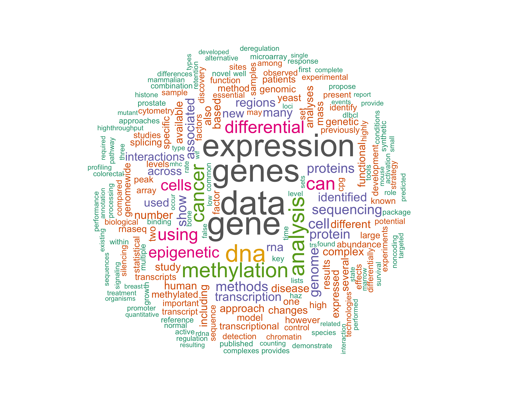

```{r, echo= FALSE, results = "asis"}
cat("<br>")
```


#### **Overall philosophy of interdisciplinary methods research**

High-throughput sequencing technologies are revolutionizing the way genomes, transcriptomes and epigenomes are studied. Generating, processing and interpreting this unprecedented magnitude of complex data and integrating multiple dimensions requires considerable research effort, for biologists, statisticians and computer scientists alike. Our group develops statistical methods for interpreting high-throughput sequencing and other genomics technologies in areas such as genome sequencing, gene expression and regulation and analysis of epigenomes. Research projects encompass three interlaced themes:

1. contribute to relevant genome-scale experimental design and data analysis challenges in close collaboration with biologists;

2. develop statistical methods and software tools for the interpretation and integration of multiple types of genome-scale data;

3. perform technical investigations to understand the performance of the technologies used to generate and of the algorithms used to process the data.


```{r, echo= FALSE, results = "asis"}
cat("<br>")
```

<!-- ```{r, echo= FALSE, results = "asis"} -->
<!-- # This is to add two blank lines -->
<!-- cat("<br><br>") -->
<!-- ``` -->

<!-- --- -->
<!-- #### **Research area 1** [ [**_Publications on this area_**](file://localhost/Users/ruizhu/Documents/work/robinsonlabuzh.github.io/publications.html)] [ [**_Tools on this area_**](file://localhost/Users/ruizhu/Documents/work/robinsonlabuzh.github.io/tools.html)] -->

<!-- ```{r echo = FALSE} -->
<!-- plot(rpois(100, 50), rpois(100, 25),  -->
<!--      cex = runif(100, min = 0, max = 5),  -->
<!--      col = rgb(0.2, runif(100), 1, 0.5), -->
<!--      xlab = "", ylab = "", pch = 19, -->
<!--      axes = FALSE) -->
<!-- ``` -->

<!-- Description of the project. Description of the project. Description of the project. Description of the project. Description of the project. Description of the project. Description of the project. Description of the project. Description of the project. Description of the project. Description of the project. Description of the project. Description of the project. Description of the project. Description of the project. Description of the project. Description of the project. Description of the project. Description of the project. Description of the project. Description of the project. Description of the project. Description of the project. Description of the project. Description of the project. Description of the project.   -->

<!-- ```{r, echo= FALSE, results = "asis"} -->
<!-- # add one blank line -->
<!-- cat("<br>") -->
<!-- ``` -->

#### **Our formula for embedded methodological research**

Our team of computational scientists is fully immersed in and motivated by biological investigations.  Many of us are statisticians, thus it is critical to be involved at the experimental design of these studies. Overall, our focus is on methodology development, but a large amount of our research time is ultimately spent with our collaborators investigating questions, either technical or biological, in a specific dataset. We do not necessarily drive the biological questions, but our expertise drives the method development that is fundamental to answering them.

```{r, echo= FALSE, results = "asis"}
cat("<br>")
```

#### **Open science and reproducibility**


Our group maintains a firm stance on open and reproducible science. The default policy is that we: i) produce documented open source software for our developed statistical and computational frameworks (typically through the Bioconductor project); ii) create code repositories for manuscript analyses; and, iii) post manuscripts as preprints. In many subfields, modern biologists are transitioning to faster, more transparent modes of scientific dissemination and we fully support these initiatives (e.g., ASAPBio).


```{r, echo= FALSE, results = "asis"}
# add one blank line
cat("<br>")
```

<!-- #### **Research area 3** [ [**_Publications on this area_**](file://localhost/Users/ruizhu/Documents/work/robinsonlabuzh.github.io/publications.html)] [ [**_Tools on this area_**](file://localhost/Users/ruizhu/Documents/work/robinsonlabuzh.github.io/tools.html)] -->

<!-- ```{r, echo= FALSE, results = "asis"} -->
<!-- # create a two column style -->
<!-- l1 <- paste0("<style> \n") -->
<!-- l2 <- paste0("\t", ".col2 {\n") -->
<!-- l3 <- paste0("\t", "\t","columns: 2 200px; \n") -->
<!-- l4 <- paste0("\t", "\t","-webkit-columns: 2 200px; \n") -->
<!-- l5 <- paste0("\t", "\t","-moz-columns: 2 200px;") -->
<!-- l6 <- paste0("\t", "} \n") -->
<!-- l7 <- paste0("</style> \n") -->
<!-- style <- do.call(paste, mget(paste0("l",1:7))) -->
<!-- cat(style) -->
<!-- ``` -->


<!-- ```{r, echo= FALSE, results = "asis"} -->
<!-- # start a division -->
<!-- cat("<div class='col2'>") -->
<!-- ``` -->


<!-- ```{r, echo=FALSE} -->
<!-- # one figure in the left column -->
<!-- plot(rpois(100, 50), rpois(100, 25),  -->
<!--      cex = runif(100, min = 0, max = 5),  -->
<!--      col = rgb(0.2, runif(100), 1, 0.5), -->
<!--      xlab = "", ylab = "", pch = 19, -->
<!--      axes = FALSE) -->
<!-- # text in the right column -->
<!-- ``` -->

<!-- ```{r, echo= FALSE, results = "asis"} -->
<!-- cat("<br>") -->
<!-- ``` -->

<!-- Description of the project. Description of the project. Description of the project. Description of the project. Description of the project. Description of the project. Description of the project. Description of the project. Description of the project. Description of the project. Description of the project. Description of the project. Description of the project. Description of the project. Description of the project. Description of the project. Description of the project. Description of the project. Description of the project. Description of the project. Description of the project. Description of the project. Description of the project. Description of the project. Description of the project. Description of the project.  -->

```{r, echo= FALSE, results = "asis"}
# end of a division (CSS code)
cat("</div>")
```
