

[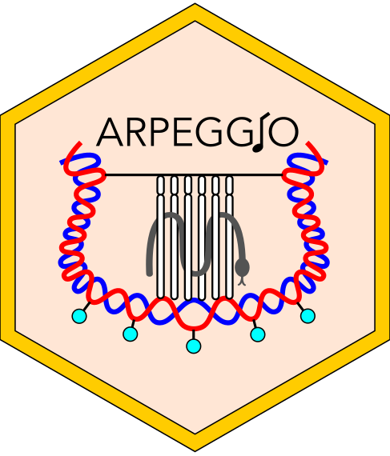](https://github.com/supermaxiste/ARPEGGIO)[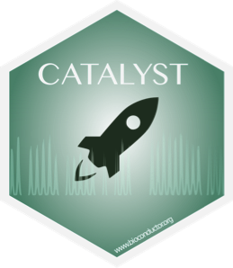](http://bioconductor.org/packages/CATALYST/)[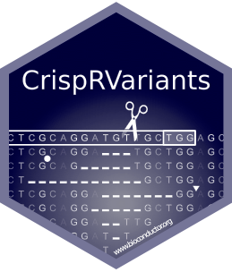](http://bioconductor.org/packages/CrispRVariants/)[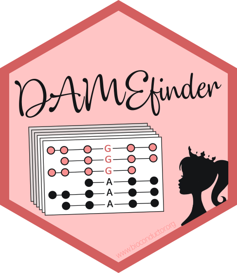](https://github.com/markrobinsonuzh/DAMEfinder)[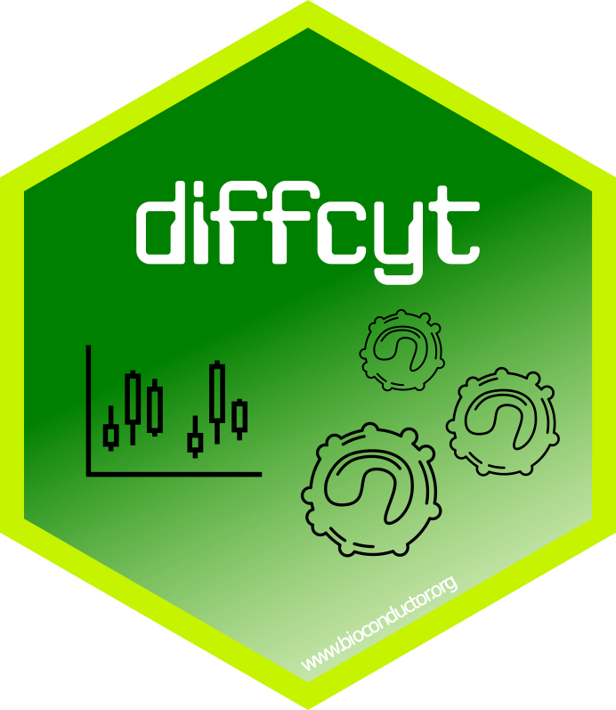](http://bioconductor.org/packages/diffcyt/)[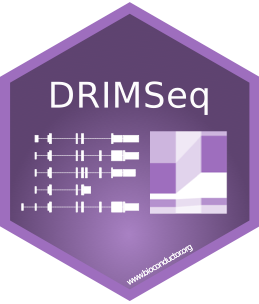](http://bioconductor.org/packages/DRIMSeq/)[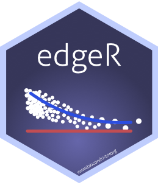](http://bioconductor.org/packages/edgeR/)[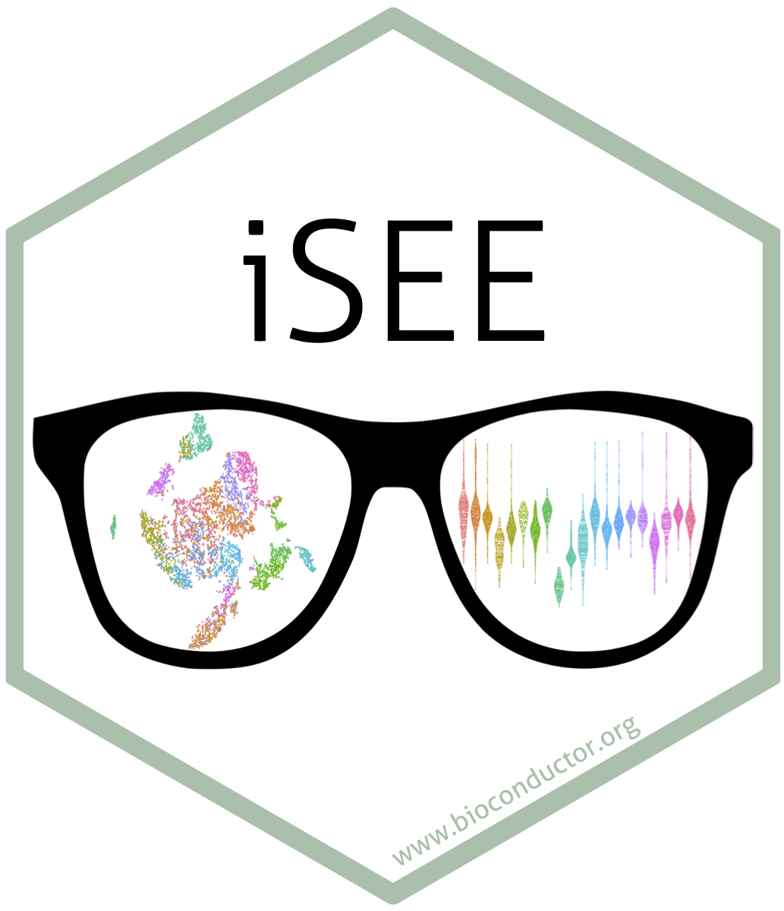](http://bioconductor.org/packages/iSEE/)[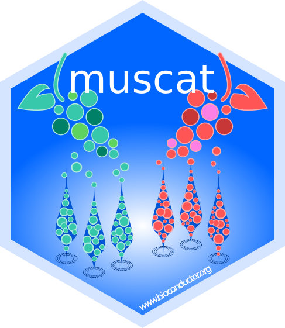](https://github.com/HelenaLC/muscat)[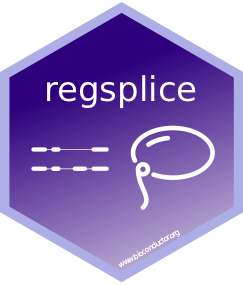](http://bioconductor.org/packages/regsplice/)[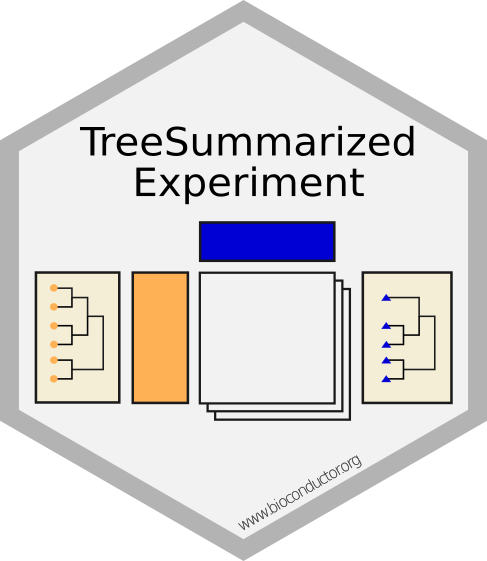](https://github.com/fionarhuang/TreeSummarizedExperiment)

### **R packages**

Name      | Author(s)               | Description 
----------|---------------|-----------------------------------
[aroma.affymetrix](http://aroma-project.org/) | Henrik Bengtsson James Bullard Kasper Hansen Pierre Neuvial Elizabeth Purdom **Mark D Robinson** Ken Simpson | An open-source R framework for microarray analysis
[BANDITS](http://bioconductor.org/packages/BANDITS/) | **Simone Tiberi** **Mark D Robinson** | A Bayesian hierarchical model for differential splicing, via differential transcript usage, accounting for sample-to-sample variability and mapping uncertainty
[CATALYST](http://bioconductor.org/packages/CATALYST/) | **Helena L Crowell** **Mark D Robinson** Vito RT Zanotelli Stéphane Chevrier Bernd Bodenmiller | Pipeline for preprocessing of cytometry data & visualization tools for differential analysis
[CellMixS](http://bioconductor.org/packages/release/bioc/html/CellMixS.html) | **Almut Lütge** **Mark D Robinson** | Toolbox to evaluate Cellspecific Mixing Scores (CMS) for different batches in scRNA-seq data
[countsimQC](https://bioconductor.org/packages/countsimQC/) | **Charlotte Soneson** | Comparison of characteristic features of count data sets
[CrispRVariants](http://bioconductor.org/packages/CrispRVariants/) | **Helen Lindsay** | Tools for counting and visualising mutations in a target location
[cytofWorkflow](https://www.bioconductor.org/packages/release/workflows/html/cytofWorkflow.html) | **Malgorzata Nowicka** | CyTOF workflow: differential discovery in high-throughput high-dimensional cytometry datasets
[DAMEfinder](https://github.com/markrobinsonuzh/DAMEfinder) | **Stephany Orjuela** Dania Machlab **Mark D Robinson** | Method to detect differential allele-specific methylation
[diffcyt](http://bioconductor.org/packages/diffcyt/) | **Lukas M Weber** | Statistical methods for differential discovery in high-dimensional cytometry data
[DRIMSeq](http://bioconductor.org/packages/DRIMSeq/) | **Malgorzata Nowicka** | Differential transcript usage and tuQTL analyses with Dirichlet-multinomial model in RNA-seq [Supplementary Page](http://imlspenticton.uzh.ch/robinson_lab/drimseq/)
[edgeR](http://bioconductor.org/packages/edgeR/) | Yunshun Chen Aaron Lun Davis McCarthy **Xiaobei Zhou** **Mark D Robinson** Gordon Smyth | Empirical Analysis of Digital Gene Expression Data in R
[FIRMAGene](https://rdrr.io/rforge/FIRMAGene/) | **Mark D Robinson** | Analysis of differential splicing with Affymetrix Gene ST array data
[flagme](http://bioconductor.org/packages/flagme/) | **Mark D Robinson** Riccardo Romoli | Analysis of Metabolomics GC/MS Data
[iCOBRA](http://bioconductor.org/packages/iCOBRA/) | **Charlotte Soneson** | Comparison and Visualization of Ranking and Assignment Methods
[iSEE](http://bioconductor.org/packages/iSEE/) | **Charlotte Soneson** Aaron Lun Federico Marini Kevin Rue-Albrecht | Interactive SummarizedExperiment Explorer
[muscat](http://github.com/HelenaLC/muscat/) | **Helena L Crowell** **Charlotte Soneson** **Pierre-Luc Germain** **Mark D Robinson** | Multi-sample multi-group scRNA-seq data analysis tools
[pipeComp](http://github.com/plger/pipeComp/) | **Pierre-Luc Germain** **Anthony Sonrel** **Mark D Robinson** | Pipeline benchmarking framework
[regsplice](http://bioconductor.org/packages/regsplice/) | **Lukas M Weber** | L1-regularization based methods for detection of differential splicing
[Repitools](http://bioconductor.org/packages/Repitools/) | **Mark D Robinson** Dario Strbenac Aaron Statham Andrea Riebler | Epigenomic tools (BayMeth)
[treeAGG](https://github.com/markrobinsonuzh/treeAGG) | **Ruizhu Huang** | Search for the optimal level of a tree to interpret signal by combining with edgeR or DESeq2
[TreeSummarizedExperiment](https://github.com/fionarhuang/TreeSummarizedExperiment) | **Ruizhu Huang** | SummarizedExperiment-based object to store tree-like data

---

### **Data resources**

Name      | Author(s)     | Description
----------|---------------|-----------------------------------
[Benchmark collection](http://imlspenticton.uzh.ch/robinson_lab/benchmark_collection) | **Robinson group** | Collection of high-throughput computational biology benchmarking data sets
[conquer](http://imlspenticton.uzh.ch:3838/conquer/) | **Charlotte Soneson** | Repository providing consistently processed public single-cell RNA-seq data sets
[DuoClustering2018](https://bioconductor.org/packages/DuoClustering2018/) | **Angelo Duò** **Charlotte Soneson** | Data package with processed data and clustering results from [Duò et al. (2018)](https://f1000research.com/articles/7-1141/v2)
[FlowRepository FR-FCM-ZZPH](http://flowrepository.org/id/FR-FCM-ZZPH) | **Lukas M Weber** | Data files for benchmark data sets used in *"Comparison of clustering methods for high-dimensional single-cell flow and mass cytometry data"* ([Weber and Robinson, 2016](https://www.ncbi.nlm.nih.gov/pubmed/27992111))
[FlowRepository FR-FCM-ZYL8](http://flowrepository.org/id/FR-FCM-ZYL8) | **Lukas M Weber** | Data files for benchmark data sets used in our paper introducing the 'diffcyt' framework ([Weber et al., 2018](https://www.biorxiv.org/content/early/2018/06/18/349738))
[HDCytoData](http://bioconductor.org/packages/release/data/experiment/html/HDCytoData.html) | **Lukas M Weber** **Charlotte Soneson** | Data package of high-dimensional cytometry data sets in SummarizedExperiment and flowSet formats
[TabulaMurisData](https://bioconductor.org/packages/TabulaMurisData/) | **Charlotte Soneson** | Bioconductor package providing access to scRNA-seq data from the [Tabula Muris Consortium](http://tabula-muris.ds.czbiohub.org/) 

---

### **Web applications**

Name      | Author(s)     | Description
----------|---------------|-----------------------------------
[CATALYST](https://catalyst-project.github.io) | **Helena L Crowell** | Tools for preprocessing of cytometry data including normalization, debarcoding, and compensation
[CrispantCal](http://lmweber.github.io/CrispantCal/) | **Lukas M Weber** | R/Shiny web app to calculate injection mix volumes for CRISPR-Cas9 experiments
[CrispRVariantsLite](http://imlspenticton.uzh.ch:3838/CrispRVariantsLite/) | **Helen Lindsay** | Graphical user interface to the R/Bioconductor CrispRVariants package
[iCOBRA](http://imlspenticton.uzh.ch:3838/iCOBRA/) | **Charlotte Soneson** | Graphical User interface to the R/Bioconductor iCOBRA package
[scrnaseq_de_evaluation](http://imlspenticton.uzh.ch:3838/scrnaseq_de_evaluation/) | **Charlotte Soneson** |  Interactive browsing and exploration of the scRNA-seq differential expression results from [Soneson and Robinson, 2018](https://www.ncbi.nlm.nih.gov/pubmed/29481549)

---

### **Other resources**

Name      | Author(s)     | Description
----------|---------------|-----------------------------------
[ABCD-DNA Supplementary Page](http://imlspenticton.uzh.ch/robinson_lab/ABCD-DNA/) | **Mark D Robinson** |  Supplementary Page with Supplementary Data (semi-processed), R Code for all Figures and analyses ([Robinson et al., 2012](https://www.ncbi.nlm.nih.gov/pubmed/22879430)).
[ARMOR](https://github.com/csoneson/ARMOR) | **Stephany Orjuela** **Ruizhu Huang** **Katharina Hembach** **Mark D Robinson** **Charlotte Soneson** |  Snakemake workflow to perform an end-to-end RNA-seq analysis.
[ARPEGGIO](https://github.com/supermaxiste/ARPEGGIO) | **Stefan Milosavljevic** Tony Kuo Samuele Decarli Lucas Mohn Jun Sese Kentaro K. Shimizu Rie Shimizu-Inatsugi **Mark D Robinson** |  SnakeMake workflow to analyse whole genome bisulfite sequencing data from allopolyploids. 
[conquer (build scripts)](https://github.com/markrobinsonuzh/conquer) | **Charlotte Soneson** **Mark D Robinson** |  Repository containing the code used to prepare the conquer (consistent quantification of external RNA-seq data sets) repository ([Soneson and Robinson, 2018](https://www.ncbi.nlm.nih.gov/pubmed/29481549)).
[conquer (differential expression evaluation)](https://github.com/csoneson/conquer_comparison) | **Charlotte Soneson** | Repository containing the code used to perform the evalutaion of differential expression analysis methods in single-cell RNA-seq data ([Soneson and Robinson, 2018](https://www.ncbi.nlm.nih.gov/pubmed/29481549)) [Supplementary Page](http://imlspenticton.uzh.ch/robinson_lab/conquer_de_comparison/)
[CrispRVariants (shiny app code)](https://github.com/markrobinsonuzh/CrispRVariantsLite) | **Helen Lindsay** |  Repository containing the code underlying the CrispRVariantsLite Shiny-based web app ([Lindsay et al, 2016](https://www.ncbi.nlm.nih.gov/pubmed/27404876)).
[cyTOF compensation](https://github.com/BodenmillerGroup/cyTOFcompensation) | Vito RT Zanotelli **Helena L Crowell** **Mark D Robinson** | Repository containing scripts to reproduce a majority of the figures from *"Compensation of Signal Spillover in Suspension and Imaging Mass Cytometry"* ([Chevrier et al., 2018](https://doi.org/10.1016/j.cels.2018.02.010)).
[cytometry-clustering-comparison](https://github.com/lmweber/cytometry-clustering-comparison) | **Lukas M Weber** | Repository of scripts to reproduce and extend analyses and figures in *"Comparison of clustering methods for high-dimensional single-cell flow and mass cytometry data"* ([Weber and Robinson, 2016](https://www.ncbi.nlm.nih.gov/pubmed/27992111))
[diffcyt-evaluations](https://github.com/lmweber/diffcyt-evaluations) | **Lukas M Weber** | Repository of scripts to reproduce evaluations and figures in our paper introducing the 'diffcyt' framework ([Weber et al., 2018](https://www.biorxiv.org/content/early/2018/06/18/349738))
[muscat-comparison](https://github.com/HelenaLC/muscat-comparison/) | **Helena L Crowell** | Repository of scripts to reproduce comparisons and figures for 'muscat' framework ([Crowell et al., 2019](https://www.biorxiv.org/content/10.1101/713412v1))
[Differential splicing comparison](https://github.com/markrobinsonuzh/diff_splice_paper) | **Charlotte Soneson** **Katharina Matthes** |  Repository containing the code for the comparison of various methods for differential isoform usage (differential splicing) detection ([Soneson, Matthes et al., 2016](https://www.ncbi.nlm.nih.gov/pubmed/26813113)) [Supplementary Page](http://imlspenticton.uzh.ch/robinson_lab/splicing_comparison/).
[edgeR robust](http://imlspenticton.uzh.ch/robinson_lab/edgeR_robust/) | **Xiaobei Zhou** |  Supplementary Page with Supplementary Data, R Code for simulations and analyses ([Zhou et al., 2014](https://www.ncbi.nlm.nih.gov/pubmed/24753412)).

